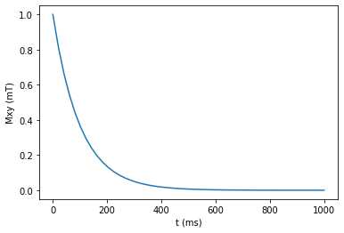
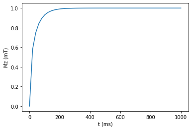
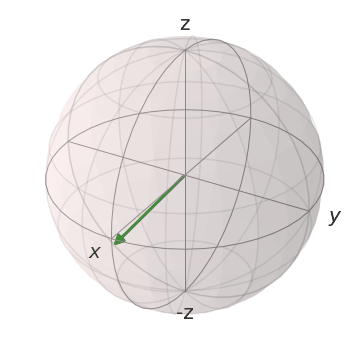
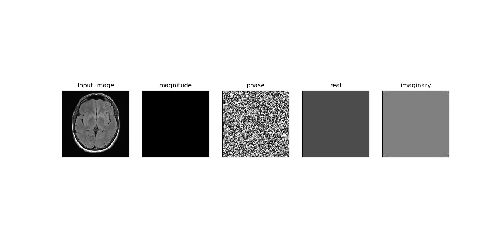
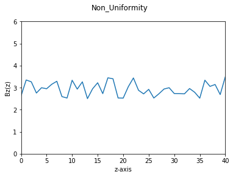

# Bloch Equation Simulation
## submitted to :
### Dr Inas Yassin
---
## submitted by:
### Alzahraa Eid Ad-Elfattah
### Amany Bahaa El-Din
### Esraa Sayed Mustafa
---
---
Bloch equation simluation introduced in our submission based on some important assumbtions which are:

1) Using Grey matter with T1 = 925ms , T2= 100ms , M0=1mT.
2) Uniform magnitic field.
3) Working on period of one second.
4) Using RF Pulse of value 90 degree.
5) Simulating in rotating frame of reference.
 

 Now, we can talk about the code step by step:
 1) Vector_States function has two arguments (component in xy direction , component in z direction) , in which "states" is initialized as a list to be appended through the for loop by the new resultant value of the two components , then calling another function which will be explained in the comming point.
 ```
 def Vector_States(xy_comp , z_comp):
        
    states = []
    
    for i in range (0,len(Mxy)-5):
        states.append((xy_comp[i]*basis(2,1) + z_comp[i+5]*basis(2,0)).unit())
    
    animate_bloch(states, duration=0.1)
```
2) animate_bloch function is the function responsilbe for creating the GIF and the image that visualize the result of the simulation , as it has two arguments which are the "states" list to visualize it as an image and a GIF, and the duration by which the states GIF is visualized. 

```
def animate_bloch(states, duration=0.1):

    b = Bloch()
    b.zlabel=['z', '-z'] 
    images=[] 
    for i in range(len(states)):
        b.clear()
        b.add_states(states[i])
        b.save('temp_file.png')
        images.append(imageio.imread('temp_file.png'))
    imageio.mimsave('bloch_anim.gif', images, duration=duration)
```
3) Calculating Mxy to repressent its exponential decay with time (starting from 0 to 1 second with step 50 ms) using the equation:
```
t = np.linspace(0, 1000, 50)
Mxy = np.exp(-t/100)
```
and plotting the result :
```
plt.figure()
plt.plot(t, Mxy)
plt.xlabel('t (ms)')
plt.ylabel('Mxy (mT)')
plt.show()
```
 resulting the following graph
 


4)Calculating Mz to represent its exponential increment using Mxy calculated from the previous point and M0 using equation:
```
Mz = np.sqrt(1-Mxy**2)
```
and plotting the result :
```
plt.figure()
plt.plot(t, Mz)
plt.xlabel('t (ms)')
plt.ylabel('Mz (mT)')
plt.show()
```
resulting the following graph
 


5) Calling Vector_States function and passing Mxy and Mz as its arguments to get the resulting simulation
```
Vector_States(Mxy , Mz)    
```




---
---
# Loading Image
First, reading image to be able to calculate Fourier Transform of it 
```
img = cv.imread("mri.jpeg",0)
```
Then , we calculated Fouries Transform of the image using fft
```
dft = np.fft.fft2(img)
```
And finally , we calculated all components of the Fourier Tansform of the image as we were confused which component is the required:
```
magnitude = np.abs(dft)
phase = np.angle(dft)
real=np.real(dft)
imaginary=np.imag(dft)
```
And for showing them we used subplot from pyplot in matplotlab to plot all of them beside the original image
```
plt.subplot(151),plt.imshow(img, cmap = 'gray')
plt.title('Input Image'), plt.xticks([]), plt.yticks([])
```
```
plt.subplot(152),plt.imshow(magnitude, cmap = 'gray')
plt.title('magnitude'), plt.xticks([]), plt.yticks([])
```
```
plt.subplot(153),plt.imshow(phase, cmap = 'gray')
plt.title('phase'), plt.xticks([]), plt.yticks([])
```
```
plt.subplot(154),plt.imshow(real, cmap = 'gray')
plt.title('real'), plt.xticks([]), plt.yticks([])
```
```
plt.subplot(155),plt.imshow(imaginary, cmap = 'gray')
plt.title('imaginary'), plt.xticks([]), plt.yticks([])
plt.show()
```
resulting in visualizing all the prevoius calculations as follows



---
---
# Simulating Non-Uniformity effect
The required was to simulate the uniformity effect; where its effect is imposed in the axial (z), and to make a plot of Bz(z).

So, we thought to create random variables within specified range , as if it represents non-uniformity effect of the variation of magnetic field with value 3T.
The following code creates 45 random variables from the scpecified range and append the list"NonUniform" with the new values representing the non-uniformity.
```
random.seed(1)
NonUniform=[]
for i in range(45):
    NonUniform.append(random.uniform(2.5 , 3.5))
    i+=1
```
Then we need to plot the resuted non-uniformity
```
plt.ylim(0, 6)
plt.xlim(0,40)
plt.plot(NonUniform)
plt.suptitle('Non_Uniformity')
plt.ylabel('Bz(z)')
plt.xlabel('z-axis')
plt.show()
```
and here is the result




---
---
### Requirements:
For each point in this simluation there were some requirements to achive it results, like installing and importing some important libraries which are:
1) qutip : for using Bloch sphere.
2) imageio : for animation and saving the result as GIF file.
3) cv2 : for reading image to calculate its Fourier Transform.
4) random : for creating random values to describe .non-uniformity effect
5)matplotlib : for plotting all graphs and components.